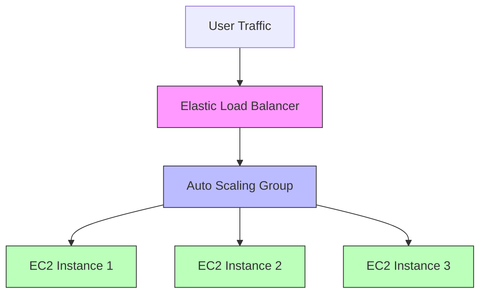

When running applications in the cloud, one of the biggest challenges is managing traffic fluctuations. During peak hours, you need more resources to handle requests, but during low-traffic periods, you don’t want to overpay for idle servers.

This is where **AWS EC2 Auto Scaling** comes into play.

---

## What is EC2 Auto Scaling?

**Amazon EC2 Auto Scaling** is a feature that automatically adjusts the number of EC2 instances in your application according to demand.

* If demand increases → Auto Scaling launches new EC2 instances.
    
* If demand decreases → Auto Scaling terminates unnecessary instances.
    

This ensures your application is **highly available, fault-tolerant, and cost-optimized**.

---

## ⚙️ Key Components of EC2 Auto Scaling

1. **Launch Template / Launch Configuration**
    
    * Defines how new instances will be launched (AMI, instance type, key pairs, etc.).
        
2. **Auto Scaling Group (ASG)**
    
    * A logical group of EC2 instances managed together.
        
    * Defines the **minimum, maximum, and desired capacity** of instances.
        
3. **Scaling Policies**
    
    * Rules that decide when to add or remove instances.
        
    * Example: Add 2 instances if CPU utilization goes above 70%.
        
4. **Health Checks**
    
    * Ensures that unhealthy instances are replaced automatically.
        

---

## 📈 Types of Scaling

* **Dynamic Scaling** → Responds to real-time changes in demand.
    
* **Scheduled Scaling** → Scales at specific times (e.g., scale up at 9 AM, scale down at 9 PM).
    
* **Predictive Scaling** → Uses machine learning to forecast traffic patterns.
    

---

## ✅ Benefits of EC2 Auto Scaling

* **High Availability** → Keeps your app running even during failures.
    
* **Cost Optimization** → Pay only for resources you actually use.
    
* **Fault Tolerance** → Automatically replaces unhealthy instances.
    
* **Flexibility** → Supports multiple scaling strategies (manual, dynamic, predictive).
    

---

## 🖼️ Diagram: How Auto Scaling Works

---

# 🛠️ Step-by-Step: Setting Up EC2 Auto Scaling in AWS Console

Let’s create a working **Auto Scaling Group (ASG)** in AWS.

---

### **Step 1: Create a Launch Template**

1. Go to **EC2 Dashboard → Launch Templates**.
    
2. Click **Create launch template**.
    
3. Enter details:
    
    * **Name**: `my-launch-template`
        
    * **AMI**: Choose Amazon Linux 2 or Ubuntu
        
    * **Instance Type**: t2.micro (Free Tier)
        
    * **Key Pair**: Select or create one
        
    * **Security Group**: Allow SSH (22) and HTTP (80)
        
4. Save the template.
    

---

### **Step 2: Create an Auto Scaling Group**

1. Go to **Auto Scaling Groups → Create Auto Scaling Group**.
    
2. Select the **launch template** you just created.
    
3. Configure the **Auto Scaling Group name** → `my-asg`.
    
4. Choose **VPC and subnets** (pick at least 2 subnets in different AZs for high availability).
    

---

### **Step 3: Attach a Load Balancer (Optional but Recommended)**

1. Create an **Application Load Balancer (ALB)**.
    
2. Attach it to your Auto Scaling Group.
    
    * This ensures traffic is distributed across instances.
        

---

### **Step 4: Configure Group Size & Scaling Policies**

1. **Set Capacity**:
    
    * Minimum: 1
        
    * Desired: 2
        
    * Maximum: 4
        
2. **Scaling Policies**:
    
    * Target tracking → Example: Keep CPU utilization at 50%.
        
    * Auto Scaling will **add or remove instances** based on this rule.
        

---

### **Step 5: Review and Create**

* Review settings and click **Create Auto Scaling Group**.
    
* AWS will now manage your EC2 instances automatically! 🎉
    

---

## Testing Auto Scaling

* To test, run a **stress test** (increase CPU load) and watch new EC2 instances launch.
    
* Reduce load and watch Auto Scaling terminate unnecessary instances.
    

---

## Conclusion

With **EC2 Auto Scaling**, you don’t have to worry about sudden traffic surges or idle resources. It ensures your application stays **resilient, scalable, and cost-efficient**.

By following the above steps, you can set up Auto Scaling in **minutes** and enjoy the benefits of cloud automation.

---